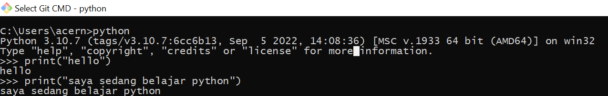
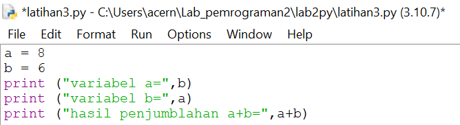
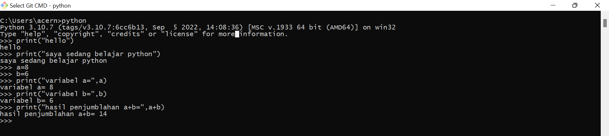
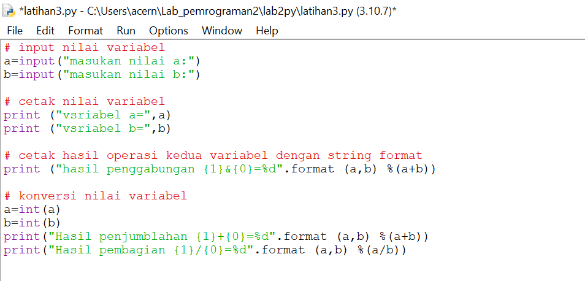

# latihan 1

### Menjalankan python Console
### Menampilkan tulisan "hello" di layar 
### Menampilkan tulisan "saya sedang belajar python"

# Latihan 2
### Menjumlahkan dua buah bilangan menggunakan variabel a dan b.
### Mendefinisikan variable a dengan nilai 8
### Mendefinisikan variable b dengan nilai 6
### Mencetak nilai variable a dan b
### Mencetak hasil penjumlahan a+b

# Latihan 2

# Latihan 3

### Menjalankan IDLE
### Membuat file baru dengan nama latihan3.py (pastikan lokasi file pada folder lab2py pada direktori kerja anda)
### Menggunakan fungsi input untuk mengambil nilai variabel dari keyboard.
# Latihan 3

# Latihan 3

